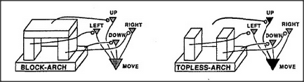

# Figure 14-14 — The Move agency with inhibitory box-frame

**File:** `ch14/14-14.png`
**Appears in:** [../../som-14.7.md](../../som-14.7.md) — *the power of negative thinking*

## What the image shows

A top-level agent labelled *Move* sits above four subagents: *Move-Left*, *Move-Right*, *Move-Up*, *Move-Down*. Surrounding the agency is the four-sided container from [14-12.md](14-12.md). Each side of the container is connected to its matching subagent by a line ending in the inhibitory *---o* symbol, so that an obstacle on the left disables Move-Left, an obstacle on top disables Move-Up, and so on. When every side carries an obstacle, every subagent is inhibited and Move itself enters a *can't-move* state.

## What it illustrates

The figure mechanises the feeling of being trapped. *Trapped* is not a separate sensation but the state in which every direction-subagent is simultaneously suppressed. Crucially, if one side is missing — as in a Topless-Arch — its subagent is no longer inhibited and Move can fire that direction automatically. The negative-thinking strategy of section 14.7 falls out of the wiring: imagine the full box, then notice which inhibitor fails to arrive.
