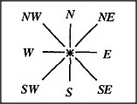

# Figure 14-15 — Compass diagram for two combined causes

**File:** `ch14/14-15.png`
**Appears in:** [../../som-14.8.md](../../som-14.8.md) — *the interaction-square*

## What the image shows

A three-by-three array of cells is drawn like a compass. The four cardinal cells are labelled *N*, *S*, *E*, *W*; the four corners are labelled *NE*, *NW*, *SE*, *SW*; and the centre cell denotes *no motion*. The horizontal axis stands for one cause (motion left or right) and the vertical axis for a second cause (motion up or down). Together they enumerate the nine possible combinations of the two causes.

## What it illustrates

Two independent causes interact to reach places that neither can reach alone. The compass layout is the simplest scheme for representing such an interaction: one cause along each axis, one cell per combined effect. Minsky proposes that many body joints — wrist, shoulder, hip, ankle, thumb, eye — are controlled by small interaction-square agencies of exactly this shape. The same array template is reused in [14-16.md](14-16.md) for the non-spatial comparison of *Tall* with *Thin*.
