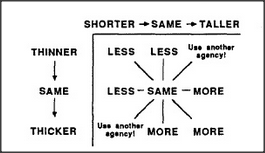

# Figure 14-16 — Tall-versus-Thin interaction-square

**File:** `ch14/14-16.png`
**Appears in:** [../../som-14.8.md](../../som-14.8.md) — *the interaction-square*

## What the image shows

The same three-by-three array as [14-15.md](14-15.md), but with the axes relabelled. The horizontal axis ranges over *Thinner* and *Wider*; the vertical axis ranges over *Taller* and *Shorter*. Each cell is filled with the conclusion that follows when the two comparisons are combined — for example, *taller and wider* yields *more*, while *taller and thinner* yields *unsure*.

## What it illustrates

The interaction-square is not really about space at all; it is a general scheme for combining any two causes. Applied to the Society-of-More, it makes explicit which combinations of *Tall* and *Thin* settle the question of which object is *more* and which combinations leave the verdict open. The figure is the canonical example of reusing one spatial uniframe as a cross-realm correspondence — the same template, different labels.
