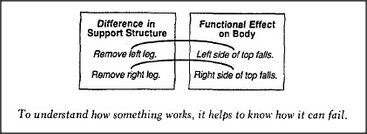

# Figure 14-2 — Removing a leg from the table

**File:** `ch14/14-2.png`
**Appears in:** [../../som-14.1.md](../../som-14.1.md) — *Using reformulation*

## What the image shows

Two stacked boxes labelled **Difference in Support Structure** and
**Functional Effect on Body**. The left box lists *Remove left
leg* and *Remove right leg*; the right box lists *Left side of
top falls* and *Right side of top falls* opposite them. Below
the boxes runs an italic caption: *To understand how something
works, it helps to know how it can fail.*

## What it illustrates

The cross-realm translation that turns the static body-support
description into a dynamic understanding of the table. Each
structural change on the left has a definite functional consequence
on the right, and the link between them is what makes the
distinction more than a label. The figure introduces the
chapter's running theme that knowing how a thing fails is part of
knowing how it works.
