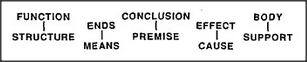

# Figure 14-3 — Dumbbell distinctions across realms

**File:** `ch14/14-3.png`
**Appears in:** [../../som-14.2.md](../../som-14.2.md) — *Means and ends*

## What the image shows

A row of five paired words arranged as dumbbells, each label
sitting above its partner: **FUNCTION / STRUCTURE**, **ENDS /
MEANS**, **CONCLUSION / PREMISE**, **EFFECT / CAUSE**, **BODY /
SUPPORT**.

## What it illustrates

Five different realms in which the same shape of distinction
appears: a goal-side and a means-side, a top and a bottom, a what
and a how. The figure is the chapter's pivot — it shows that
the body-support cut introduced in the architectural realm has
exact counterparts in language, logic, physics and design, and
that recognising those counterparts is the substrate of metaphor
and reformulation.
