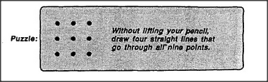

# Figure 14-5 — The nine-dot puzzle

**File:** `ch14/14-5.png`
**Appears in:** [../../som-14.2.md](../../som-14.2.md) — *Means and ends*

## What the image shows

A framed panel. On the left, a three-by-three grid of nine black
dots labelled **Puzzle**. On the right, the instruction:
*Without lifting your pencil, draw four straight lines that go
through all nine points.*

## What it illustrates

The setup for the classic problem that demonstrates self-imposed
constraints. The figure deliberately presents the dots in a
visually square arrangement so that the reader does the work of
inscribing the invisible boundary themselves, before
[14-6.md](14-6.md) reveals that the only solutions must cross
that boundary.
