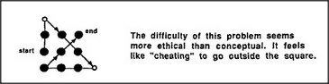

# Figure 14-6 — Solving the nine-dot puzzle by leaving the square

**File:** `ch14/14-6.png`
**Appears in:** [../../som-14.3.md](../../som-14.3.md) — *Seeing squares*

## What the image shows

The same nine-dot grid as in [14-5.md](14-5.md), now with the
solution drawn over it. Four straight strokes form a tilted
zigzag: a label **start** marks the lower-left dot, **end** the
upper-right area, and two of the four strokes clearly extend
beyond the implied square. A caption to the right reads, *The
difficulty of this problem seems more ethical than conceptual. It
feels like "cheating" to go outside the square.*

## What it illustrates

The reformulation move at work. The solution is geometrically
straightforward once the boundary is allowed to dissolve; the
difficulty was in noticing that the boundary was added by the
viewer, not by the puzzle. The caption names the feeling that
makes the trap stick — the sense that crossing the square is
disallowed, even though no rule ever said so.
