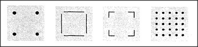

# Figure 14-7 — Four things that are all "squares"

**File:** `ch14/14-7.png`
**Appears in:** [../../som-14.3.md](../../som-14.3.md) — *Seeing squares*

## What the image shows

Four small square panels in a row. The first holds only four dots
at the corners, with no lines between them. The second shows four
line segments forming the four sides of a square. The third shows
only four right-angle brackets at the corners, with no joining
edges. The fourth is a five-by-five lattice of dots filling its
panel.

## What it illustrates

Four very different stimuli that are all read as "square". The
first has corners but no edges; the second has edges but no
explicit corners; the third has only the corner-brackets; the
fourth has neither distinguished corners nor a single explicit
edge. The figure motivates the section's question of how vision
arrives at the same global form from incompatible local evidence,
which is answered by mixing sensation with expectation in
[14-9.md](14-9.md).
