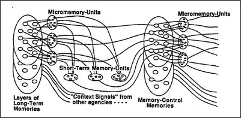

# Figure 15-3 — Memory machinery inside a typical agency

**File:** `ch15/15-3.png`
**Appears in:** [../../som-15.8.md](../../som-15.8.md) — *anatomy of memory*

## What the image shows

A large box labelled with one agency contains three nested layers. The innermost layer holds several *micromemory-units*, each drawn as a small temporary K-line able to save or restore the state of many agents at once. Above them sits a row of *short-term memory-units* that can in turn save or restore the micromemories. Arrows lead out toward *long-term memory* and across to neighbouring agencies, and a small control block manages the flow.

## What it illustrates

The figure proposes a layered memory plant inside every substantial agency: fast micromemories for the immediate state, short-term memories for keeping place across interruptions, and slow transfers into long-term storage. Each tier protects the one beneath it from being overwritten too soon. The presence of a memory-system inside the memory-controller itself answers the recursive question of how the controlling machinery learns to control.
