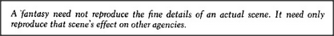

# Figure 16-10 — Stimulus versus simulus across the vision levels

**File:** `ch16/16-10.png`
**Appears in:** [../../som-16.8.md](../../som-16.8.md) — *stimulus vs. simulus*

## What the image shows

A vertical stack of vision levels rises from retinal sensors at the bottom through boundary and texture detectors, region and shape descriptors, frame-based object recognisers, structural relationships, and finally goals and functions at the top. Two arrows enter the stack: a *stimulus* at the lowest level (rays of light) and a *simulus* delivered directly to one of the higher levels by an internal K-line.

## What it illustrates

A fantasy need not paint a picture. To reproduce the effect of a presence, the brain can bypass the retina entirely and inject the right state into a few high-level agents. The figure justifies the term *simulus*: same effect on cognition as a stimulus, but with a tiny fraction of the machinery. It also explains why imagined scenes can lack fine detail yet still carry the full sense of significance.
