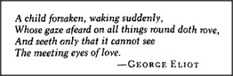

# Figure 16-12 — Infant proto-specialists in cross-exclusion

**File:** `ch16/16-12.png`
**Appears in:** [../../som-16.9.md](../../som-16.9.md) — *infant emotions*

## What the image shows

A small infant figure is drawn beside a cluster of proto-specialists — *Hunger*, *Sleepiness*, *Affection*, *Play*, *Contentment*, *Hunger-Rage*. Heavy mutual-inhibition arrows connect them in the cross-exclusion pattern of [16-6.md](16-6.md). Only one specialist at a time emerges as the visible expression on the infant's face.

## What it illustrates

The figure accounts for the sharp on-off mood shifts of young children. Many proto-specialists may continue working in parallel, but cross-exclusion lets only one of them control expression, voice, and posture at any moment. The clarity this enforces is itself adaptive — a single unambiguous signal is what makes a caretaker's response reliable.
