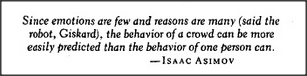

# Figure 16-13 — The adult emotion landscape

**File:** `ch16/16-13.png`
**Appears in:** [../../som-16.10.md](../../som-16.10.md) — *adult emotions*

## What the image shows

An adult figure stands beside a scattered field of labelled emotions — *Anger*, *Fear*, *Love*, *Hate*, *Jealousy*, *Greed*, *Curiosity*, *Boredom*, and many others. Unlike the tidy cross-exclusion cluster of [16-12.md](16-12.md), the labels overlap, blur into one another, and connect by faint lines suggesting partial similarities rather than clean exclusions.

## What it illustrates

Adult emotion is no longer a small set of mutually inhibiting proto-specialists. Through development the original states are overwritten, combined, suppressed, and pressed into social use, leaving a landscape of words that no longer map cleanly onto distinct mental processes. The figure visualises why common-sense psychology cannot even agree on which emotions exist.
