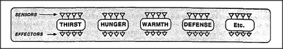

# Figure 16-2 — An animal as an assembly of proto-specialists

**File:** `ch16/16-2.png`
**Appears in:** [../../som-16.3.md](../../som-16.3.md) — *mental proto-specialists*

## What the image shows

A figure of an animal is broken into separate boxes, each labelled with a basic need — *Thirst*, *Hunger*, *Warmth*, *Safety*, *Sleep*, *Companionship*. Each box is drawn as its own mini-agency with its own sensors and effectors attached. The boxes sit side by side without sharing organs.

## What it illustrates

A first, naïve design for an artificial animal: list every need and build a separate proto-specialist for each. The diagram makes vivid the cost of such a design — duplicated heads, hands and feet — and so motivates the next two figures, which show how real animals share organs ([16-4.md](16-4.md)) and share learned subroutines.
