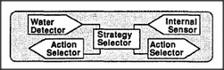

# Figure 16-3 — Inside the Thirst proto-specialist

**File:** `ch16/16-3.png`
**Appears in:** [../../som-16.3.md](../../som-16.3.md) — *mental proto-specialists*

## What the image shows

A single proto-specialist labelled *Thirst* is opened up to reveal its parts. A sensor detects internal dryness, a recognizer identifies water and cups, a planner selects an approach, and effectors drive the limbs toward the goal. Each part is drawn as a small box with arrows pointing toward an action output.

## What it illustrates

Even one need requires a whole mini-mind: a way to detect the need, a way to recognise the object that satisfies it, and a way to act. The figure shows what would have to be replicated *per need* under the design of [16-2.md](16-2.md), and so makes the case for sharing organs across needs in [16-4.md](16-4.md) and for sharing learned subroutines later in the chapter.
