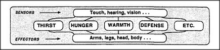

# Figure 16-4 — Proto-specialists sharing common organs

**File:** `ch16/16-4.png`
**Appears in:** [../../som-16.3.md](../../som-16.3.md) — *mental proto-specialists*

## What the image shows

The separated proto-specialists of [16-2.md](16-2.md) are redrawn around a single shared body. *Thirst*, *Hunger*, *Warmth*, *Safety* and the rest now connect, through a common bus of sensors and effectors, to one set of eyes, hands, and feet. Lines from each specialist converge on the shared organs.

## What it illustrates

The economical design: keep one body, share its organs among many proto-specialists, and let them take turns. This sharing creates the contention problem that the rest of the chapter addresses — how to decide which proto-specialist gets control of the shared organs at any moment — and motivates the cross-exclusion arrangement of [16-6.md](16-6.md).
