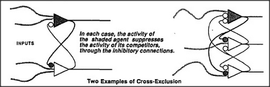

# Figure 16-6 — Cross-exclusion among competing agents

**File:** `ch16/16-6.png`
**Appears in:** [../../som-16.4.md](../../som-16.4.md) — *cross-exclusion*

## What the image shows

Several agents are drawn in a row — for example *Hunger*, *Thirst*, *Warmth*, *Safety*. Each agent has an inhibitory connection (the *---o* notation) running to every other agent in the group, producing a dense bidirectional mesh of mutual inhibitions.

## What it illustrates

Cross-exclusion is the mechanism Minsky proposes for the principle of *noncompromise* among proto-specialists. When any one agent becomes slightly more active than its neighbours, its outward inhibitions weaken them, which in turn weakens their inhibitions of it, producing an avalanche that locks one winner in. The same wiring doubles as a short-term memory: whichever agent wins remains active until a strong external signal flips the group.
