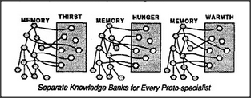

# Figure 16-7 — Separate memory banks per goal

**File:** `ch16/16-7.png`
**Appears in:** [../../som-16.6.md](../../som-16.6.md) — *motivation*

## What the image shows

Each proto-specialist — *Hunger*, *Thirst*, *Warmth* and so on — is drawn with its own private memory bank attached. A gate beside each memory is wired so that only the matching active proto-specialist can write into it. The agents share organs but not memories.

## What it illustrates

This is the simplest way to keep what is learned for one goal from contaminating another. Hunger's memories form only when Hunger is active, so the child never reaches for a cup out of loneliness. The figure makes the cost visible too — entirely separate banks for every goal — which sets up the alternative shared memory of [16-8.md](16-8.md).
