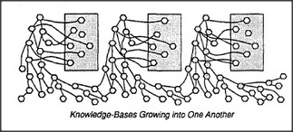

# Figure 16-8 — Specialists sharing a general memory

**File:** `ch16/16-8.png`
**Appears in:** [../../som-16.6.md](../../som-16.6.md) — *motivation*

## What the image shows

The per-goal banks of [16-7.md](16-7.md) are replaced by a single, common memory pool. Every proto-specialist now reads from and writes to the same store, drawn as one large box with many incoming and outgoing connections.

## What it illustrates

A shared memory is far more economical and lets one proto-specialist benefit from what another has learned. But it creates the problem the next sections solve: if any specialist may rearrange the common store, it can damage structures the others rely on. Because each specialist is too small to understand the others, the only available strategy is the *exploitation* sketched in [16-9.md](16-9.md).
