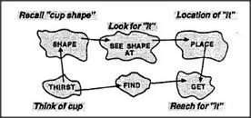

# Figure 16-9 — Thirst exploiting See, Find, and Get

**File:** `ch16/16-9.png`
**Appears in:** [../../som-16.7.md](../../som-16.7.md) — *exploitation*

## What the image shows

The proto-specialist *Thirst* is shown with two outward connections. One leads to *See*, causing it to hallucinate a cup at the highest levels of vision. The other leads to *Find*, which then activates *Get*. The agents *See*, *Find* and *Get* form a small horizontal chain, each passing control rather than data to the next.

## What it illustrates

A small agent achieves a complex goal without containing the knowledge needed to carry it out. Thirst does not know what a cup looks like, but it can arouse See's cup-recognising machinery and then let Find and Get follow their own logic. The pattern prefigures language: saying *please pass the cup* is the same trick — a short signal that exploits the listener's memory rather than transmitting a picture.
