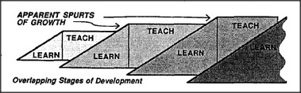

# Figure 17-2 — Sequences of teaching-selves

**File:** `ch17/17-2.png`
**Appears in:** [../../som-17.1.md](../../som-17.1.md) — *sequences of teaching-selves*

## What the image shows

A horizontal chain of boxes is labelled *Stage 1*, *Stage 2*, *Stage 3*, and so on. Each stage points forward to the next with an arrow marked *teaches*; each later stage also retains a connection back to the earlier ones, drawn as a thin line marked *remains available*. Above the chain, a single outline labelled *Self* loosely encloses all the stages together.

## What it illustrates

Development is not a single climb but a relay. Each stage first learns under the previous stage's guidance, then turns around and teaches the next. Earlier stages do not vanish; they remain quietly available as resources the present mind can fall back on. The faint encircling Self gives the picture its second point: the sense of personal unity is what the persistence of these older stages feels like from inside.
