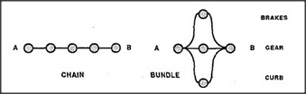

# Figure 18-11 — Chain versus bundle

**File:** `ch18/18-11.png`
**Appears in:** [../../som-18.5.md](../../som-18.5.md) — *strong arguments*

## What the image shows

Two diagrams sit side by side. On the left, labelled *CHAIN*, a row of small circles is connected in a single line from endpoint *A* to endpoint *B*. On the right, labelled *BUNDLE*, three separate chains run in parallel between the same two endpoints, all converging at *A* and at *B*; the chains are tagged *BRAKES*, *GEAR*, and *CURB*.

## What it illustrates

The figure contrasts the two simplest ways of linking parts: serially and in parallel. A serial chain fails the moment any one link breaks, while a parallel bundle survives until *every* path has been broken. The car-on-the-hill example — foot brake, parking gear, wheels turned to the curb — is mapped directly onto the bundle: three independent chains whose joint failure is far less likely than any single one. The same logic underlies *strong arguments* in the section: many independent lines of reasoning supporting one conclusion.
