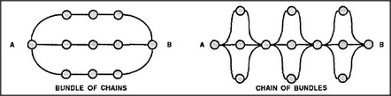

# Figure 18-12 — Bundle of chains, chain of bundles

**File:** `ch18/18-12.png`
**Appears in:** [../../som-18.5.md](../../som-18.5.md) — *strong arguments*

## What the image shows

Two more linkage diagrams between *A* and *B*. On the left, labelled *BUNDLE OF CHAINS*, three full chains run side by side, each composed of several serial links. On the right, labelled *CHAIN OF BUNDLES*, the structure inverts: at each step along the way, several parallel links share the load, and these multi-link stages are themselves strung in series.

## What it illustrates

The figure shows that serial and parallel composition can be nested. Each serial connection makes a structure weaker; each parallel connection makes it stronger; mixing them yields the full vocabulary of practical reliability — and, by analogy, of practical argument. Some lines of reasoning are bundles of complete chains (several whole proofs supporting one claim); others are chains of bundles (a sequence of inferences, each itself supported by several pieces of evidence).
