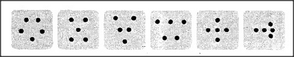

# Figure 18-13 — Six arrangements that all mean five

**File:** `ch18/18-13.png`
**Appears in:** [../../som-18.7.md](../../som-18.7.md) — *what is a number?*

## What the image shows

Six small tiles are drawn in a row. Each tile contains five dots arranged differently — a die-five quincunx, a row, a V, a W, an X, and an irregular cluster. The number of dots is the same in every tile; only the geometric arrangement varies.

## What it illustrates

*Five* is not a single fact but a family of overlapping skills: counting, matching the fingers of a hand, recognising a familiar shape, picking up each item once, reciting *one-two-three-four-five*. The figure shows just the shape-recognition member of that family, and demonstrates that the same number can be apprehended through many unrelated patterns. The wider lesson is that useful meanings are cross-connected networks, not single chains of definition — switch out a broken sense and another remains.
