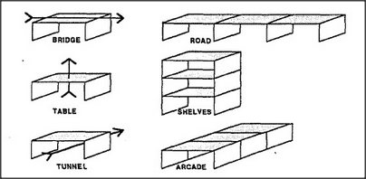

# Figure 18-6 — One arch, many roles; chains of roles

**File:** `ch18/18-6.png`
**Appears in:** [../../som-18.3.md](../../som-18.3.md) — *chaining*

## What the image shows

The figure is a six-panel grid. On the left, a single rectangular arch is redrawn three times with different captions — *BRIDGE*, *TABLE*, *TUNNEL* — and arrows that indicate the direction of use (over, under, on top). On the right, three corresponding chains repeat the same arch end-to-end: a row of bridges becomes a *ROAD*, a stack of tables becomes *SHELVES*, and a line of tunnels becomes an *ARCADE*.

## What it illustrates

One uniframe — the arch — supports many readings, and each reading admits its own kind of chaining. The figure makes the point that chaining is not a single trick but a family of operations that runs through many realms at once: structural chains in space, functional chains in use, and conceptual chains in thought. The shared properties of chains — weakest-link failure, repair by link, connection between movement and cause — apply equally well to all six panels.
