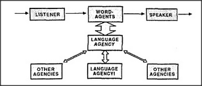

# Figure 19-1 — The three regions of the language-agency

**File:** `ch19/19-1.png`
**Appears in:** [../../som-19.2.md](../../som-19.2.md) — *the language-agency*

## What the image shows

A central box labelled *LANGUAGE AGENCY* sits at the middle of the figure. Above it, *WORD-AGENTS* connect outward to *LISTENER* on the left and *SPEAKER* on the right. Below, three boxes — *OTHER AGENCIES*, a second *LANGUAGE AGENCY!*, and another *OTHER AGENCIES* — are linked back up with bidirectional arrows. The duplicated language-agency at the bottom indicates that the agency can exploit itself.

## What it illustrates

The figure proposes a three-tier division: an upper tier specifically concerned with words, a lower tier of agencies *affected* by words, and a middle tier that links words to recollections and expectations. The self-referential link at the bottom is the chapter's distinctive claim — language has an unusual capacity to control its own memories by treating itself as just another agency to be addressed.
