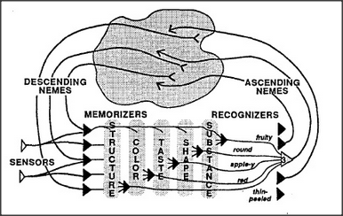

# Figure 19-10 — Closing the ring of the language-agency

**File:** `ch19/19-10.png`
**Appears in:** [../../som-19.10.md](../../som-19.10.md) — *closing the ring*

## What the image shows

A large cloud-shaped region at the top stands for the higher language-agency, fed by *DESCENDING NEMES* on the left and feeding *ASCENDING NEMES* on the right. Below the cloud, a row of *MEMORIZERS* opens into agencies labelled *STRUCTURE*, *COLOR*, *TASTE*, *SHAPE*, *SUBSTANCE*. *SENSORS* enter from the lower left. To the right of the agencies, a stack of *RECOGNIZERS* — *fruity*, *round*, *apple-y*, *red*, *thin-peeled* — sends arrows back up into the cloud, closing the loop.

## What it illustrates

The figure assembles every part introduced in chapter 19 into a single circular flow. Polynemes descend from the language-agency into the lower agencies; recognisers ascend back up from those agencies; the cloud at the top closes the ring. Given any three or four matching properties the loop will arouse the *apple* polyneme, which in turn restores the other apple properties through the descending nemes. Reminding — reconstructing a whole from a few parts — falls out of the wiring, with no magic required.
