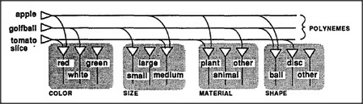

# Figure 19-2 — Polynemes broadcasting to many agencies

**File:** `ch19/19-2.png`
**Appears in:** [../../som-19.5.md](../../som-19.5.md) — *polynemes*

## What the image shows

Three horizontal lines labelled *apple*, *golfball*, and *tomato slice* run across the top of the figure and are bracketed as *POLYNEMES*. Each line drops branches into four downstream agencies labelled *COLOR*, *SIZE*, *MATERIAL*, and *SHAPE*. Inside each downstream agency, small triangular selectors point at one of several alternative states: *red/green/white* for colour, *large/small/medium* for size, *plant/animal/other* for material, *ball/disc/other* for shape.

## What it illustrates

A polyneme is one signal that means different things to different listeners. The *apple* line does not carry a description; it merely tells colour to settle on *red*, size on *medium*, material on *plant*, and shape on *ball*. Each downstream agency holds its own private mapping. Politicians and polynemes share the trick of saying one word and being heard differently by every audience.
