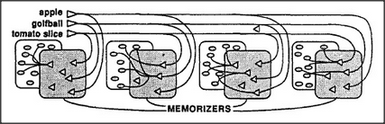

# Figure 19-3 — K-line memorizers next to each agency

**File:** `ch19/19-3.png`
**Appears in:** [../../som-19.5.md](../../som-19.5.md) — *polynemes*

## What the image shows

The polyneme lines for *apple*, *golfball*, and *tomato slice* run across the top of the figure as before. This time the path into each downstream agency passes through a small cluster of K-lines drawn just outside it, labelled collectively *MEMORIZERS*. Inside each agency a dense tangle of arrows shows the partial state that the matching K-line restores when its polyneme is active.

## What it illustrates

The figure refines [19-2.md](19-2.md) by showing where the mapping lives. Each downstream agency does not interpret the polyneme directly; instead, a little bank of K-lines sitting beside it learns, polyneme by polyneme, which partial state to arouse inside. Memories are formed and stored close to the places where they are used — the architectural principle that makes polynemes practical to learn.
