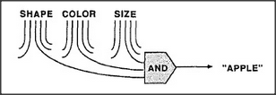

# Figure 19-4 — Recognising apple by conjunction

**File:** `ch19/19-4.png`
**Appears in:** [../../som-19.6.md](../../som-19.6.md) — *recognizers*

## What the image shows

Three labelled inputs descend from the top of the figure — *SHAPE*, *COLOR*, *SIZE*. Their lines converge on a single box labelled *AND*, whose output arrow points to the word *"APPLE"*.

## What it illustrates

The simplest recogniser is an AND-agent: it fires only when every required feature is present simultaneously. The figure makes the rule explicit — *round AND red AND apple-sized* — and so introduces the basic atom of recognition before the section moves on to the more forgiving weighted schemes of [19-5.md](19-5.md). The figure also illustrates the failure mode of strict conjunction: any missing feature blocks recognition entirely.
