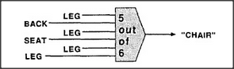

# Figure 19-5 — Five-out-of-six chair recogniser

**File:** `ch19/19-5.png`
**Appears in:** [../../som-19.6.md](../../som-19.6.md) — *recognizers*

## What the image shows

Six input lines feed into a single threshold box labelled *5 out of 6*. The inputs are *BACK*, *LEG*, *SEAT*, *LEG*, *LEG*, *LEG* — one back, one seat, four legs. The output arrow leads to the word *"CHAIR"*.

## What it illustrates

Strict conjunction is too brittle for real-world recognition; a chair with one leg out of sight or a sitter on the seat will fail an AND-agent. The figure replaces AND with a threshold: any five of the six features suffice. This is the first sketch of an evidence-weighing machine, and it sets up the limitation the next two figures will explore — threshold counting still cannot enforce relationships among the features, so it confuses arrangements that are *almost* chairs ([19-6.md](19-6.md), [19-7.md](19-7.md)).
