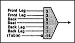

# Figure 19-6 — Weighted evidence with a negative input

**File:** `ch19/19-6.png`
**Appears in:** [../../som-19.7.md](../../som-19.7.md) — *weighing evidence*

## What the image shows

Six input lines enter a threshold box, each carrying a small integer weight. The inputs read *Front Leg* (3), *Front Leg* (3), *Back Leg* (3), *Seat* (3), *Back Leg* (3), *Back Leg* (3), and *(Table)* with a weight of *-15*. The threshold is reached only when the weighted sum is large enough, and the output arrow exits to the right.

## What it illustrates

The figure generalises the threshold recogniser of [19-5.md](19-5.md) by attaching weights to each piece of evidence — and, crucially, by allowing *negative* weights. The output of a table-recogniser is fed in with a large negative weight so that strong evidence of a table inhibits the chair conclusion. This is the essence of Rosenblatt's *Perceptron* and the starting point for the limitation explored in [19-7.md](19-7.md): no weighting alone can capture relations among the features.
