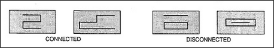

# Figure 19-7 — Connected versus disconnected patterns

**File:** `ch19/19-7.png`
**Appears in:** [../../som-19.7.md](../../som-19.7.md) — *weighing evidence*

## What the image shows

A rectangular panel holds four small line-drawings. The two on the left, labelled *CONNECTED*, can each be traced with a single continuous line. The two on the right, labelled *DISCONNECTED*, each require two separate strokes. Visually the four figures all contain similar fragments — right-angle corners, line endings, and horizontal and vertical segments.

## What it illustrates

This is the *Perceptrons* counterexample of Minsky and Papert. If each picture is chopped into tiny fragments, the heap of fragments is identical for connected and disconnected patterns alike. No feature-weighing machine can tell the heaps apart, because the distinction lives entirely in how the fragments are related, not in which fragments are present. The figure marks the limit of pure evidence-summing recognition and motivates the structural representations the rest of the book develops.
