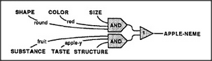

# Figure 19-8 — Recognising apple from internal states

**File:** `ch19/19-8.png`
**Appears in:** [../../som-19.9.md](../../som-19.9.md) — *recognizing thoughts*

## What the image shows

Six labelled inputs descend in two groups. The left group — *SHAPE*, *COLOR*, *SIZE* with the values *round*, *red*, *apple-y* — feeds one AND-box. The right group — *SUBSTANCE*, *TASTE*, *STRUCTURE* with the values *fruit*, *apple-y*, *thin-peeled* — feeds a second AND-box. Both AND-outputs converge on a final triangular agent, whose output arrow is labelled *APPLE-NEME*.

## What it illustrates

The figure makes the chapter's key claim concrete: recognising an apple from a description in words and recognising one from the senses use the same kind of machinery. The inputs do not come from the eyes; they come from internal agencies (*Taste*, *Substance*, *Physical Structure*) that words have already set. A recogniser attached to *those* states arouses the same apple-neme that vision would. Thus thoughts and percepts share representations and recognisers.
