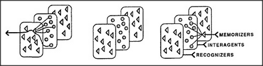

# Figure 19-9 — Three layers: memorizers, intergents, recognizers

**File:** `ch19/19-9.png`
**Appears in:** [../../som-19.9.md](../../som-19.9.md) — *recognizing thoughts*

## What the image shows

Three stacked card-like panels run across the figure, each containing a dense field of small triangular agents. On the left, a single arrow points outward from one panel. The right-hand version labels the three layers as *MEMORIZERS*, *INTERGENTS*, and *RECOGNIZERS*, with arrows leading from one layer into the next.

## What it illustrates

Each agency needs two kinds of memory: a bank of K-line *memorizers* that can restore prior partial states, and a *recognition dictionary* — recognisers tuned to detect those states. The middle band of *intergents* mediates between them. The figure compresses the architecture introduced in the preceding sections into a single picture: read states out (memorizers), describe states (recognizers), and connect them through the agency's own internal traffic.
