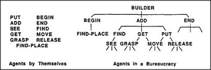

# Figure 2-1 — Agents by themselves and agents in a bureaucracy

**File:** `ch2/2-1.png`
**Appears in:** [../../som-2.1.md](../../som-2.1.md) — *Components and connections*

## What the image shows

Two panels side by side, each labelled at the bottom. On the **left**,
under the heading *Agents by Themselves*, the same set of names from
the block-building example is listed loosely, one per line, in two
columns: **PUT**, **ADD**, **SEE**, **GET**, **GRASP**, **FIND-PLACE**
and **BEGIN**, **END**, **FIND**, **MOVE**, **RELEASE**. On the
**right**, under *Agents in a Bureaucracy*, the same names are wired
into a three-level tree headed by **BUILDER**, with **BEGIN**, **ADD**,
and **END** beneath it and the rest of the workers hanging from ADD as
in Figure 1-3.

## What it illustrates

The chapter's central move: the parts of a mind matter no more than
the connections between them. The unsorted list and the wired tree
contain *exactly the same agents* and yet only the right-hand panel
can build a tower. The picture makes "components and connections" a
visible argument rather than a slogan.
