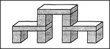

# Figure 20-1 — Nine blocks, three arches, or one superarch

**File:** `ch20/20-1.png`
**Appears in:** [../../som-20.3.md](../../som-20.3.md) — *visual ambiguity*

## What the image shows

A three-dimensional block construction stands against a plain background. It is built from nine rectangular blocks: three small arches across the bottom, joined by a single long lintel running over all of them. Depending on the viewer's focus, the figure can be read as nine separate blocks, as three side-by-side arches, or as one large nine-block superarch.

## What it illustrates

Vision is just as ambiguous as language. The same arrangement of edges admits several legitimate parsings at different levels of organisation. The figure makes the point that recognising *block*, *arch*, and *superarch* are not optional refinements; they are independent interpretations that the visual system normally settles among very quickly, without the conscious mind noticing any conflict.
