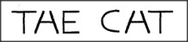

# Figure 20-2 — Selfridge's *THE CAT*

**File:** `ch20/20-2.png`
**Appears in:** [../../som-20.3.md](../../som-20.3.md) — *visual ambiguity*

## What the image shows

The two words *THE CAT* are printed in plain block capitals. The middle letter of each word — the *H* of *THE* and the *A* of *CAT* — is drawn identically as the same ambiguous glyph, neither cleanly an H nor cleanly an A. Yet the eye reads the first as *H* and the second as *A* without hesitation.

## What it illustrates

Oliver Selfridge's example shows that low-level visual evidence cannot, by itself, resolve every ambiguity. The identical glyph is interpreted in two different ways because the surrounding context — the language-agency's expectation of the words *THE* and *CAT* — feeds back down into vision. The figure is the clearest demonstration in the book that perception is not bottom-up: the simulus seen at any level is shaped by the states already running in the agencies above.
