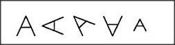

# Figure 20-3 — Five different drawings of the same description

**File:** `ch20/20-3.png`
**Appears in:** [../../som-20.3.md](../../som-20.3.md) — *visual ambiguity*

## What the image shows

A horizontal panel holds five small line drawings. Each is a triangle with two extra straight lines extending outward from one of its vertices, but the triangle's proportions, orientation, and the angle of the extensions differ in every drawing. The shapes look superficially different yet share the same underlying structural description.

## What it illustrates

If the figures are described by the precise lengths, directions, and positions of their lines they look unrelated. Described instead as *a triangle with two lines extended from one of its vertices*, they become five instances of one thing. The figure complements [20-2.md](20-2.md): there, one drawing is read in two ways; here, five drawings are read as one. Both make the same point — what we *see* is governed by the descriptions already active inside.
