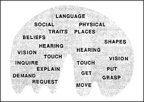

# Figure 20-4 — The nemeic spiral of an individual mind

**File:** `ch20/20-4.png`
**Appears in:** [../../som-20.6.md](../../som-20.6.md) — *the nemeic spiral*

## What the image shows

An arched, brain-shaped region is filled densely with words drawn at different scales. Near the top, larger labels — *LANGUAGE*, *SOCIAL*, *PHYSICAL*, *PLACES*, *TRAITS*, *SHAPES*, *BELIEFS* — cluster toward the speech-related part of the diagram. Below them, mid-sized labels appear — *VISION*, *HEARING*, *TOUCH*. At the base, the most concrete agencies surface as small labels: *INQUIRE*, *EXPLAIN*, *DEMAND*, *REQUEST*, *GET*, *GRASP*, *PUT*, *MOVE*.

## What it illustrates

A nemeic network is roughly hierarchical but riddled with cross-connections, shortcuts, and exceptions. The figure conveys two things at once: that nemes near the language-agency are easier to put into words (because public speech disciplines them), and that nemes deeper in the system are increasingly idiosyncratic and harder to communicate. The same picture also supports the *spiral* idea — control can spiral *down* into detail when work goes well, and *up* into diagnosis when it does not.
