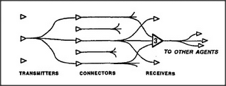

# Figure 20-6 — Transmitters, connectors, receivers

**File:** `ch20/20-6.png`
**Appears in:** [../../som-20.9.md](../../som-20.9.md) — *distributed memory*

## What the image shows

Three vertical columns of small triangular agents are drawn left to right. The leftmost column is labelled *TRANSMITTERS*, the middle column *CONNECTORS*, and the rightmost column *RECEIVERS*. Arrows fan out from each transmitter through a mesh of connector lines into several receivers, and arrows continue rightward toward *TO OTHER AGENTS*.

## What it illustrates

The figure redraws the connection-line scheme as three explicit layers. Transmitters are essentially K-lines or memorizers that broadcast signals; receivers are recognisers tuned to particular combinations; connectors form the mediating web that carries the traffic between them. The layering separates *what signals are sent*, *how they reach where they go*, and *what arouses what* — the three independent learning problems the section addresses.
