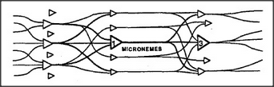

# Figure 20-7 — A network of branching evidence-weighing agents

**File:** `ch20/20-7.png`
**Appears in:** [../../som-20.9.md](../../som-20.9.md) — *distributed memory*

## What the image shows

The three-column layout of [20-6.md](20-6.md) is collapsed into a single dense mesh. Triangular agents on the left send arrows into a central band labelled *MICRONEMES*, which in turn fans into another column of agents on the right. Every agent now branches both at its inputs and at its outputs.

## What it illustrates

Each agent is simultaneously a transmitter and a receiver — an evidence-weighing unit with its own threshold. The single mesh is what arises when the clean three-layer separation of [20-6.md](20-6.md) is allowed to recurse. The figure also supports the section's argument against random wiring: groups of nearby connection lines acquire local significance and end up acting as the most important agents of nearby levels — they become *micronemes* in their own right.
