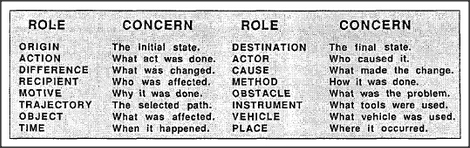

# Figure 21-1 — Roles and concerns of an action

**File:** `ch21/21-1.png`
**Appears in:** [../../som-21.2.md](../../som-21.2.md) — *pronomes*

## What the image shows

A two-column table lists roles on the left and their corresponding concerns on the right. *ORIGIN* — the initial state; *ACTION* — what act was done; *DIFFERENCE* — what was changed; *RECIPIENT* — who was affected; *MOTIVE* — why it was done; *TRAJECTORY* — the selected path; *OBJECT* — what was affected; *TIME* — when it happened. A parallel column adds *DESTINATION*, *ACTOR*, *CAUSE*, *METHOD*, *OBSTACLE*, *INSTRUMENT*, *VEHICLE*, *PLACE*, each with a one-line concern.

## What it illustrates

Every language has dedicated grammatical machinery for these roles because they recur in almost any account of an action. The figure lays out the fixed inventory of role-slots that a sentence about *Jack drove from Boston to New York* fills in: actor, vehicle, origin, destination, trajectory, time. The list is the raw material for the Trans-frame of [21-2.md](21-2.md), and motivates the *pronome* idea — short tokens that stand for the contents of each slot.
