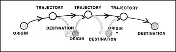

# Figure 21-3 — Chaining Trans-frames

**File:** `ch21/21-3.png`
**Appears in:** [../../som-21.3.md](../../som-21.3.md) — *Trans-frames*

## What the image shows

Three Trans-frames are drawn end-to-end. Each consists of an *ORIGIN* circle, a *TRAJECTORY* arrow, and a *DESTINATION* circle. Where one frame ends, the next begins: the destination of the first is also the origin of the second, and so on, so the four circles form a single chain across the figure.

## What it illustrates

Once the Trans-frame skeleton is in place, building a chain of actions reduces to a bead-stringing operation: identify each frame's Destination with the next frame's Origin. The figure makes the equivalence visible — Boston → New York → Washington collapses to Boston → Washington, John → you → Mary becomes John → Mary, and so on. This is why the same chaining skill can be applied to spatial movement, information flow, and ownership transfer.
