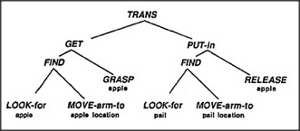

# Figure 21-4 — The Builder society for "put apple in pail"

**File:** `ch21/21-4.png`
**Appears in:** [../../som-21.4.md](../../som-21.4.md) — *communication among agents*

## What the image shows

A tree of agents headed by *TRANS* at the top. *TRANS* branches into *GET* and *PUT-in*. *GET* in turn branches into *FIND* and *GRASP apple*; *PUT-in* branches into *FIND* and *RELEASE apple*. Each *FIND* sub-tree expands into *LOOK-for* and *MOVE-arm-to*, annotated with *apple* on the left subtree and *pail* on the right.

## What it illustrates

The figure decomposes a single Trans of an apple into the hierarchy of agents needed to carry it out. The bracketed labels — *apple* and *pail* — appear only at the leaves; the middle managers (*GET*, *PUT-in*, *FIND*) carry no object information at all. They do not need to. The next section ([21-5.md](21-5.md)) shows how the leaf agents acquire the right contents through shared context rather than through messages from above.
