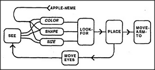

# Figure 21-5 — Automatic finding machine

**File:** `ch21/21-5.png`
**Appears in:** [../../som-21.5.md](../../som-21.5.md) — *automatism*

## What the image shows

An *APPLE-NEME* line enters from the upper left and connects to three small agency boxes labelled *COLOR*, *SHAPE*, *SIZE*. These three boxes feed into *SEE* (or are routed from *SEE*), and their values flow rightward into *LOOK-FOR*, which then feeds *PLACE*, which feeds *MOVE-ARM-TO*. A separate loop returns through *MOVE EYES* back into *SEE*.

## What it illustrates

The figure shows how *Look-for* and *Move-arm-to* operate without explicit instructions from above. The polyneme for *apple* sets Color, Shape, and Size into the right partial states; *LOOK-FOR* lives in that context and so cannot help but look for something red, round, and apple-sized. Once *PLACE* is filled, *MOVE-ARM-TO* fires for the same reason. The shared *Place* representation is what concentrates many agencies on a single object — the mechanism the section identifies with *focus of mental attention*.
