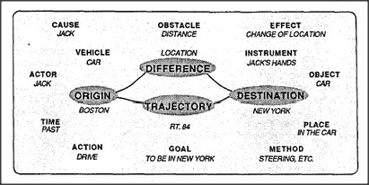

# Figure 21-6 — A fully populated Trans-frame

**File:** `ch21/21-6.png`
**Appears in:** [../../som-21.6.md](../../som-21.6.md) — *Trans-frame Pronomes*

## What the image shows

The Trans-frame is drawn as a horizontal bridge: *ORIGIN* on the left (*BOSTON*) connects through *TRAJECTORY* (*RT. 84*) and *DIFFERENCE* (*LOCATION*) to *DESTINATION* on the right (*NEW YORK*). Surrounding the bridge are filled slots for the other roles: *CAUSE — JACK*, *OBSTACLE — DISTANCE*, *EFFECT — CHANGE OF LOCATION*, *VEHICLE — CAR*, *INSTRUMENT — JACK'S HANDS*, *ACTOR — JACK*, *OBJECT — CAR*, *TIME — PAST*, *PLACE — IN THE CAR*, *ACTION — DRIVE*, *GOAL — TO BE IN NEW YORK*, *METHOD — STEERING, ETC.*

## What it illustrates

This is the full constellation of pronomes that one Trans-frame can activate at once when a sentence such as *Jack drove from Boston to New York on the turnpike with Mary* is understood. The bridge from Origin to Destination is the load-bearing structure — without it there is nothing to chain — and the surrounding slots supply everything else needed to connect what we know about *things* with what we know about *using* them.
