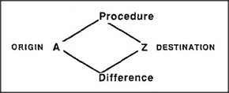

# Figure 23-1 — Procedure and Difference between two situations

**File:** `ch23/23-1.png`
**Appears in:** [../../som-23.1.md](../../som-23.1.md) — *a world of differences*

## What the image shows

Two circles labelled *A* (origin) and *Z* (destination) sit at the left and right of a diamond-shaped diagram. The top edge of the diamond is labelled *Procedure*; the bottom edge is labelled *Difference*. Both edges connect *A* to *Z*.

## What it illustrates

Almost every mental activity discussed in the section maps onto this diamond. Predicting runs *Procedure* forward from *A* to a tentative *Z*; explaining runs *Difference* backward to a likely *Procedure*; wanting runs *Difference* forward and asks what *Procedure* would reduce it. Predicting, expecting, explaining, wanting, escaping, attacking, defending, and abstracting are different traversals of the same two edges. Reasoning by analogy then operates one level up — on differences between differences.
