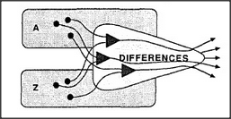

# Figure 23-2 — The duplication problem

**File:** `ch23/23-2.png`
**Appears in:** [../../som-23.2.md](../../som-23.2.md) — *differences and duplicates*

## What the image shows

Two shaded panels labelled *A* and *Z* sit on the left, each containing a few scattered dots. Several arrows run from these dots into a larger central region marked *DIFFERENCES*, which then emits arrows outward to the right.

## What it illustrates

To detect what differs between two arrangements, a third agency must receive two sets of inputs that match almost perfectly; anything else looks like a difference. The figure forces the consequence into view — both source agencies *A* and *Z*, and all the subagencies they depend on, must be virtually identical or the difference-detector will drown in spurious mismatches. This is the duplication problem: comparing two states of mind appears to require duplicating the machinery that produced them.
