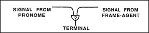

# Figure 24-1 — A frame terminal as an AND-agent

**File:** `ch24/24-1.png`
**Appears in:** [../../som-24.3.md](../../som-24.3.md) — *How Trans-frames Work*

## What the image shows

A small triangular AND-agent sits at the bottom of the figure, labelled *TERMINAL*. Two arrows enter it from above: one from the left, labelled *SIGNAL FROM PRONOME*, and one from the right, labelled *SIGNAL FROM FRAME-AGENT*.

## What it illustrates

A frame terminal is just an AND-agent with two inputs — one carrying the activation of the surrounding frame, the other carrying the activation of a particular pronome (Origin, Destination, Vehicle, etc.). The terminal fires only when both arrive together, so the K-line attached to its output is aroused only in the right role at the right time. This is the atomic operation of frame-based memory.
