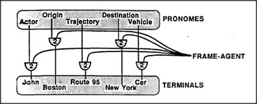

# Figure 24-2 — A complete Trans-frame as a row of AND-agents

**File:** `ch24/24-2.png`
**Appears in:** [../../som-24.3.md](../../som-24.3.md) — *How Trans-frames Work*

## What the image shows

A horizontal bar at the top is labelled *FRAME-AGENT* and feeds downward into a row of four AND-agent terminals. The four pronome lines — *Actor*, *Origin*, *Trajectory*, *Destination*, *Vehicle* — descend into those terminals from the top. Below the terminals, the corresponding fillers appear as K-line labels: *John*, *Boston*, *Route 95*, *New York*, *Car*.

## What it illustrates

The figure stacks several copies of [24-1.md](24-1.md) into one structure. Each pronome line activates exactly the terminal whose role it matches, and only while the frame as a whole is active. Wondering about the Destination retrieves *New York*; wondering about the Vehicle retrieves *Car*. The frame is nothing more than a row of AND-agents wired to K-lines — a striking demonstration of how much representational power follows from very few primitives.
